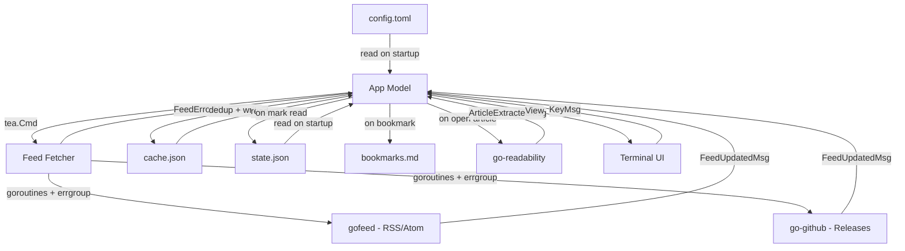
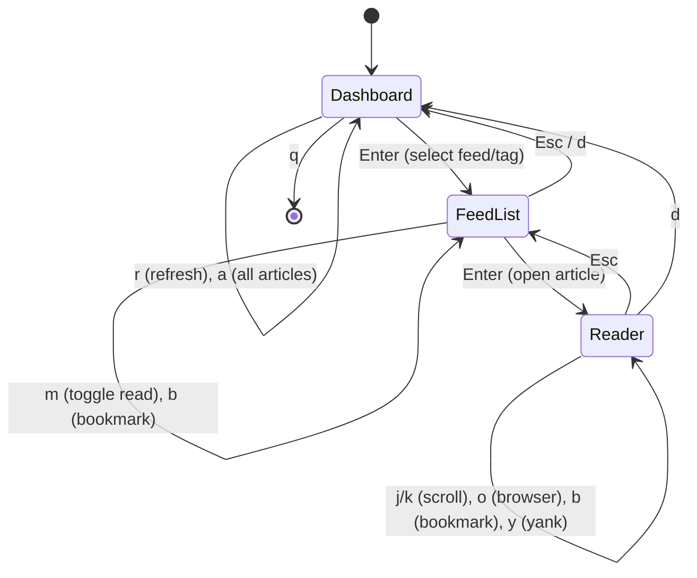

# Architecture

## Overview

Feeder follows the Elm architecture via bubbletea: a single model owns all state, messages drive updates, and the view is a pure function of state. Background work (feed fetching, article extraction) runs in goroutines and communicates back through bubbletea's command system.

## Data Flow



## Screen Flow



## Storage Layout

```
~/.config/feeder/
└── config.toml              # Feed list + settings (source of truth)

~/.cache/feeder/
└── cache.json               # Fetched articles (ephemeral, local only)

~/Documents/ (or configured path)
├── feeder-state.json        # Read article GUIDs (synced via GitHub)
└── feeder-bookmarks.md      # Saved articles (synced via GitHub)
```

## Concurrency Model

```
Main goroutine (bubbletea)
│
├── Ticker goroutine ──── sends TickMsg every N minutes
│
└── Refresh command ──── spawns errgroup
    ├── fetch feed 1 ─┐
    ├── fetch feed 2 ──┤  semaphore limits concurrency
    ├── fetch feed 3 ──┤
    └── fetch feed N ─┘
         │
         └── each sends FeedUpdatedMsg or FeedErrorMsg
```

No shared mutable state. The bubbletea model is only touched by the main goroutine. Background goroutines communicate exclusively through messages.
